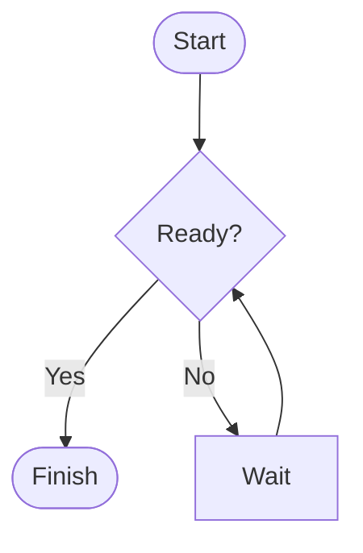
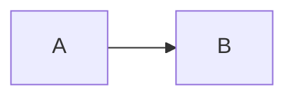

# Obsidian Mermaid Flow Enhancer

Make Mermaid flowcharts easier to scan in Obsidian with compact node spacing, aligned decision branches, rounded orthogonal connectors, and an ancestor-path highlight when you hover or focus a node or edge.

**Mermaid Flow Enhancer** is the plugin name. “Obsidian” describes the platform it extends; this is an independent project and is not affiliated with or endorsed by Obsidian.

> **Beta:** This plugin is under active development. External user testing and submission to the Obsidian Community plugins directory are still pending. Please report issues with a small Mermaid example and your Obsidian version.

## Preview

These GIFs use the plugin's actual layout and hover modules in a browser test stand. They are **browser previews**, not recordings of Obsidian.


[Light and dark theme preview](docs/assets/themes.gif) · [Compact layout preview](docs/assets/compact-layout.gif) · [Short video](docs/assets/browser-preview.mp4) · [Print sample PDF](docs/assets/browser-preview-print.pdf)

## Features

- Compact flowchart spacing with readable labels.
- Aligns branches leaving decision nodes and routes connectors with rounded corners.
- Highlights the ancestors leading to the node under the pointer or keyboard focus. Moving across an edge updates the highlighted path.
- Works with light and dark Obsidian themes.
- Leaves non-flowchart Mermaid diagrams to Mermaid's normal renderer.
- Per-diagram opt-out with `%% mfe:off`.

The plugin wraps Mermaid's render function and adjusts the generated SVG. It does not rewrite your notes.

## Requirements

- Obsidian 1.14.2 or later (the conservative minimum declared in the plugin manifest).
- Desktop and mobile are declared as supported by the manifest; beta testing across devices is pending.

The plugin runs locally without telemetry or network requests. No additional service or account is required. Development and downloading releases require network access.

## Install

### From a release

1. Download `main.js`, `manifest.json`, and `styles.css` from the same [GitHub release](https://github.com/itsNikolay/obsidian-mermaid-flow-enhancer/releases).
2. Create `<your-vault>/.obsidian/plugins/mermaid-flow-enhancer/`.
3. Copy all three files into that directory.
4. In Obsidian, open **Settings → Community plugins**, enable community plugins if prompted, then enable **Mermaid Flow Enhancer**.

### For development

```sh
git clone https://github.com/itsNikolay/obsidian-mermaid-flow-enhancer.git
cd obsidian-mermaid-flow-enhancer
npm ci
npx playwright install chromium
npm test
npm run test:integration
npm run build
```

Copy `main.js`, `manifest.json`, and `styles.css` to the plugin directory shown above, then reload Obsidian. For update and rollback steps, see the [release checklist](docs/release-checklist.md).

## Use

Create a normal Mermaid flowchart code block in a note:

````markdown

````

Hover a node or connector to trace its incoming ancestor path. Keyboard focus on a node also shows its path. The highlight clears after the pointer leaves the diagram.

Add the opt-out comment inside a Mermaid diagram to retain Mermaid's rendering for that diagram:

````markdown

````

## Settings

- **Compact layout**: enable or disable the plugin's flowchart layout adjustments.
- **Path highlight**: enable or disable ancestor-path highlighting.
- **Animation duration**: transition time in milliseconds; default `450`.
- **Hover delay**: delay before a highlight clears after leaving a target; default `180` ms.

Per-diagram `%% mfe:off` takes precedence over the plugin settings.

## Demo vault

Open the Markdown files under [`demo-vault/`](demo-vault/) in a disposable test vault with the plugin enabled. The generated `big100.md` and `big300.md` diagrams exercise larger graphs; they are artificial fixtures, not performance guarantees.

## Compatibility and reporting issues

The plugin uses Obsidian's Mermaid loader and Mermaid's generated SVG structure. Obsidian or Mermaid updates can change that structure, so compatibility beyond the manifest minimum has not yet been established. Please include your Obsidian version, platform, theme, and a minimal diagram when [opening an issue](https://github.com/itsNikolay/obsidian-mermaid-flow-enhancer/issues/new/choose).

## Development

See [testing and development](docs/testing.md) and the [demo script](docs/demo-script.md).

## Upgrade and rollback

Plugin releases do not migrate or rewrite note contents. Plugin preferences are stored separately by Obsidian and use the `compactLayout`, `pathHighlight`, `animationDuration`, and `hoverDelay` settings. New or missing values use defaults; numeric values are normalized to the supported range when loaded. Before replacing release files, disable the plugin and keep a copy of its existing plugin folder. To roll back, disable the plugin, restore the previous `main.js`, `manifest.json`, and `styles.css` together, and re-enable it. If you remove the plugin, Mermaid code blocks remain in notes and Obsidian renders them without this plugin.

## License

[MIT](LICENSE). Copyright (c) itsNikolay.
