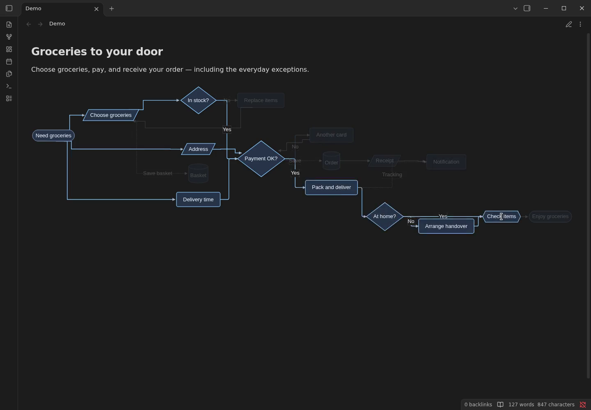
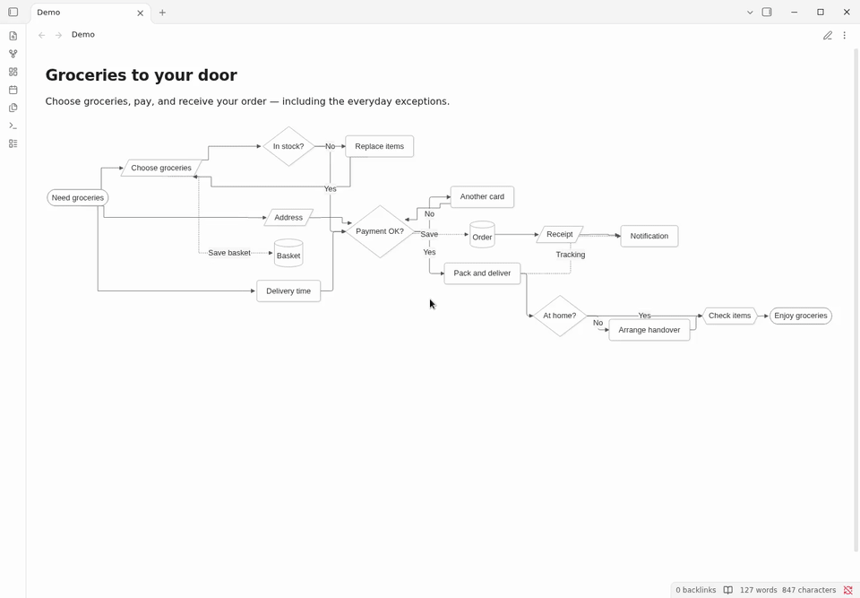
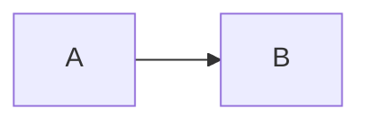

# Obsidian Mermaid Flow Enhancer

An **Obsidian Mermaid plugin** for readable Markdown flowcharts: compact diagram layouts, aligned decision branches, rounded orthogonal connectors, light and dark theme styling, and ancestor-path highlighting when you hover or focus any node or edge.

[](https://community.obsidian.md/plugins/mermaid-flow-enhancer)

The button opens the official plugin installation page. Choose **Add to Obsidian**, then **Install** and **Enable** in the app.

**Mermaid Flow Enhancer** is the plugin name. “Obsidian” describes the platform it extends; this is an independent project and is not affiliated with or endorsed by Obsidian.

> **Beta:** This plugin is under active development. External user testing is pending. The [Community directory listing](https://community.obsidian.md/plugins/mermaid-flow-enhancer) is published with an active Add to Obsidian link. The initial scan completed; catalogue installation in the desktop app is still being verified. Please report issues with a small Mermaid example and your Obsidian version.

## Preview

The screenshots and recordings show plugin 0.1.2 in real Linux Obsidian 1.14.4, running inside Docker with a synthetic vault.



The demo follows an everyday **grocery delivery order**: missing-item replacements, payment retries, packing, delivery, and notifications. Its single-screen flowchart has 17 nodes, 22 connections, six node shapes, parallel setup branches, two retry loops, and dotted notification links. The GIF and MP4 demonstrate ancestor-path highlighting in both themes. The MP4 records the virtual screen at 30 fps; no host Obsidian window or personal notes were used.



[Light screenshot](docs/assets/grocery-delivery-light.png) · [Dark screenshot](docs/assets/grocery-delivery-dark.png) · [Grocery delivery video](docs/assets/grocery-delivery.mp4) · [Diagram source](demo-vault/Examples/grocery-delivery.md) · [Capture report](docs/assets/grocery-delivery-capture.md)

Supplemental 0.1.0 [browser previews](docs/assets/path-highlight.gif) show the same plugin layout and interaction using a browser test stand. [Theme preview](docs/assets/themes.gif) · [Compact layout preview](docs/assets/compact-layout.gif) · [Browser video](docs/assets/browser-preview.mp4) · [Print sample PDF](docs/assets/browser-preview-print.pdf). They are test-stand captures, not Obsidian recordings.

## Mermaid flowcharts in Obsidian

Use Mermaid Flow Enhancer for **Obsidian flowchart styling**, **compact Mermaid diagrams**, **aligned decision branches**, **rounded orthogonal arrows**, and **interactive path highlighting** in Markdown notes. It helps you follow process diagrams and retry flows while keeping Mermaid source editable.

**По-русски:** плагин Mermaid для Obsidian — компактные блок-схемы, выравнивание веток «да/нет», аккуратные стрелки, подсветка пути при наведении, оформление диаграмм для светлой и тёмной темы.

## Features

- Compact flowchart spacing with readable labels.
- Aligns branches leaving decision nodes and routes connectors with rounded corners and centered side attachments.
- Highlights ancestors of the hovered or focused node by traversing forward layout edges. Return/back edges are excluded from ancestor traversal, though a hovered edge itself can still highlight. Moving across an edge updates the highlighted path.
- Works with light and dark Obsidian themes, with a uniform slate-blue palette in dark mode.
- Leaves non-flowchart Mermaid diagrams to Mermaid's normal renderer.
- Per-diagram opt-out with `%% mfe:off`.

The plugin wraps Mermaid's render function and adjusts the generated SVG. It does not rewrite your notes.

## Release security checks

New releases require a completed VirusTotal scan of the three plugin files before publication. Reports include SHA-256 hashes, engine verdicts, and public report links. Configuration and scan status are documented in the [VirusTotal guide](docs/virus-scanning.md). [Release 0.1.2 scan](docs/security/virustotal-0.1.2.md): no detections among engines completing analysis on 2026-10-09 (0/60 JavaScript, 0/61 manifest, 0/56 CSS). Failed, timed-out, and unsupported engines are recorded in the JSON report. Earlier releases are not claimed as scanned.

## Requirements

- Obsidian 1.14.2 or later (the conservative minimum declared in the plugin manifest).
- The plugin uses browser APIs and does not require desktop-only Node.js/Electron APIs. Mobile verification is pending; the manifest leaves `isDesktopOnly` disabled.

The plugin runs locally without telemetry or network requests. No additional service or account is required. Development and downloading releases require network access.

## Install

### From the community directory

[](https://community.obsidian.md/plugins/mermaid-flow-enhancer)

Open the [Mermaid Flow Enhancer listing](https://community.obsidian.md/plugins/mermaid-flow-enhancer) and choose **Add to Obsidian**, then install and enable the plugin. If your app does not find the newly published listing yet, use the release installation below.

### From a release

1. Download `main.js`, `manifest.json`, and `styles.css` from the same [GitHub release](https://github.com/itsNikolay/obsidian-mermaid-flow-enhancer/releases).
2. Create `<your-vault>/.obsidian/plugins/mermaid-flow-enhancer/`.
3. Copy all three files into that directory.
4. In Obsidian, open **Settings → Community plugins**, enable community plugins if prompted, then enable **Mermaid Flow Enhancer**.

### Isolated application tests and recordings

Use `npm run docker:check` or `npm run docker:record` to run real Linux Obsidian in Docker without opening the host app. See the [Docker testing guide](docs/docker-testing.md) for exported videos, screenshots, and reports.

### For development

```sh
git clone https://github.com/itsNikolay/obsidian-mermaid-flow-enhancer.git
cd obsidian-mermaid-flow-enhancer
npm ci
npx playwright install chromium
npm run typecheck
npm test
npm run test:integration
npm run build
```

Copy `main.js`, `manifest.json`, and `styles.css` to the plugin directory shown above, then reload Obsidian. For update and rollback steps, see the [release checklist](docs/release-checklist.md).

## Use

Create a normal Mermaid flowchart code block in a note:

````markdown

````

Hover a node or connector to trace its incoming ancestor path. Keyboard focus on a node also shows its path. The highlight clears after the pointer leaves the diagram.

Add the opt-out comment inside a Mermaid diagram to retain Mermaid's rendering for that diagram:

````markdown

````

## Settings

- **Compact layout**: enable or disable the plugin's flowchart layout adjustments.
- **Path highlight**: enable or disable ancestor-path highlighting.
- **Animation duration**: transition time in milliseconds; default `450`.
- **Hover delay**: delay before a highlight clears after leaving a target; default `180` ms.

Per-diagram `%% mfe:off` takes precedence over the plugin settings.

## Demo vault

Open the Markdown files under [`demo-vault/`](demo-vault/) in a disposable test vault with the plugin enabled. The generated `big100.md` and `big300.md` diagrams exercise larger graphs; they are artificial fixtures, not performance guarantees.

## Compatibility and reporting issues

The plugin uses Obsidian's Mermaid loader and Mermaid's generated SVG structure. Obsidian or Mermaid updates can change that structure, so compatibility beyond the manifest minimum has not yet been established. Please include your Obsidian version, platform, theme, and a minimal diagram when [opening an issue](https://github.com/itsNikolay/obsidian-mermaid-flow-enhancer/issues/new/choose).

## Development

The plugin and development scripts are written in TypeScript with strict type checking. `npm run typecheck` checks types; `npm run check` runs linting, type checking, all tests, and the build. The distributable remains a JavaScript `main.js` bundle for Obsidian.

See [testing and development](docs/testing.md) and the [demo script](docs/demo-script.md).

## Upgrade and rollback

Plugin releases do not migrate or rewrite note contents. Plugin preferences are stored separately by Obsidian and use the `compactLayout`, `pathHighlight`, `animationDuration`, and `hoverDelay` settings. New or missing values use defaults; numeric values are normalized to the supported range when loaded. Before replacing release files, disable the plugin and keep a copy of its existing plugin folder. To roll back, disable the plugin, restore the previous `main.js`, `manifest.json`, and `styles.css` together, and re-enable it. If you remove the plugin, Mermaid code blocks remain in notes and Obsidian renders them without this plugin.

## License

[MIT](LICENSE). Copyright (c) itsNikolay.

Development checks: see [testing](docs/testing.md) and [code linting](docs/linting.md).
