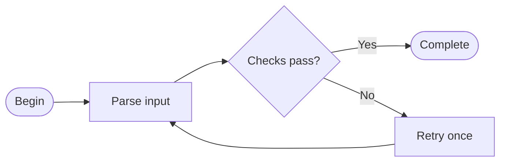

# Cycle and underscore IDs

```mermaid
flowchart LR
  start_here([Begin]) --> parse_input[Parse input]
  parse_input --> verify_again{Checks pass?}
  verify_again -->|Yes| done_step([Complete])
  verify_again -->|No| retry_step[Retry once]
  retry_step --> parse_input
```
