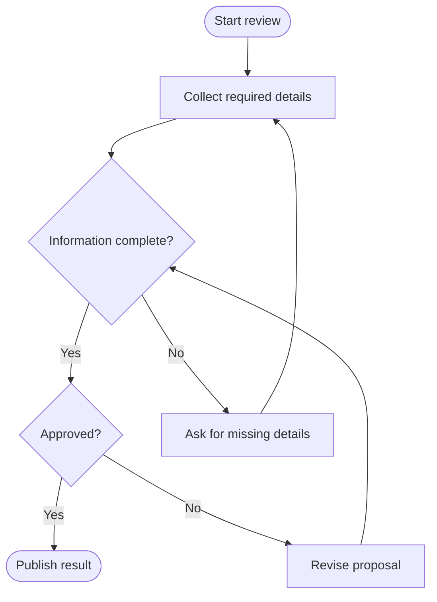

# Decision branches

```mermaid
flowchart TD
  begin([Start review]) --> gather[Collect required details]
  gather --> ready{Information complete?}
  ready -->|Yes| approve{Approved?}
  ready -->|No| request[Ask for missing details]
  request --> gather
  approve -->|Yes| publish([Publish result])
  approve -->|No| revise[Revise proposal]
  revise --> ready
```
