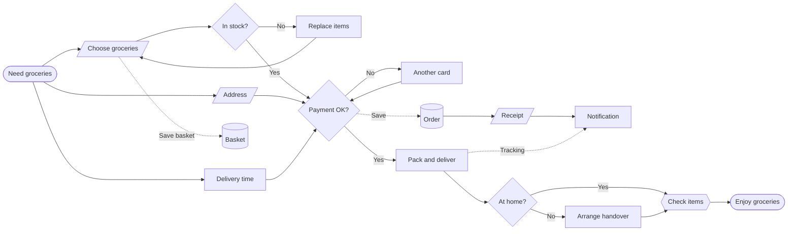

# Groceries to your door

Choose groceries, pay, and receive your order — including the everyday exceptions.

```mermaid
flowchart LR
  start([Need groceries]) --> list[/Choose groceries/]
  start --> address[/Address/]
  start --> slot[Delivery time]
  list --> stock{In stock?}
  list -. Save basket .-> basket[(Basket)]
  stock -->|No| replace[Replace items]
  replace --> list
  stock -->|Yes| paid{Payment OK?}
  address --> paid
  slot --> paid
  paid -->|No| retry[Another card]
  retry --> paid
  paid -->|Yes| courier[Pack and deliver]
  paid -. Save .-> order[(Order)]
  order --> receipt[/Receipt/]
  receipt --> notice[Notification]
  courier --> home{At home?}
  courier -. Tracking .-> notice
  home -->|No| handover[Arrange handover]
  home -->|Yes| check{{Check items}}
  handover --> check
  check --> done([Enjoy groceries])
```
