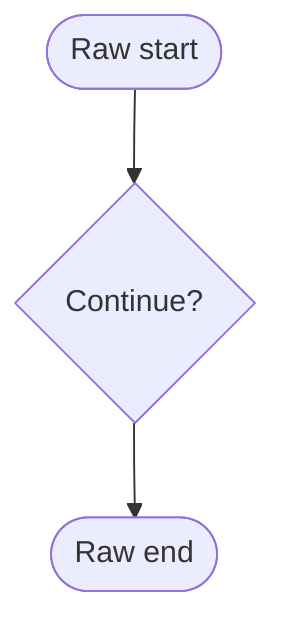
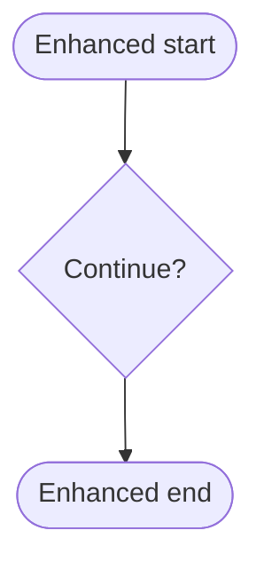

# Per-diagram opt-out

The first diagram includes `%% mfe:off`; the second uses the plugin's normal enhancements.

```mermaid
%% mfe:off
flowchart TD
  raw_start([Raw start]) --> raw_check{Continue?}
  raw_check --> raw_end([Raw end])
```

```mermaid
flowchart TD
  enhanced_start([Enhanced start]) --> enhanced_check{Continue?}
  enhanced_check --> enhanced_end([Enhanced end])
```
