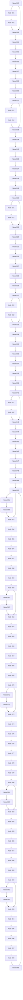

# Generated 100-node flowchart fixture

Artificial stress-test diagram. Node IDs include underscores. This fixture is not a performance guarantee.

```mermaid
flowchart TD
  node_000[Node 000]
  node_001[Node 001]
  node_002[Node 002]
  node_003[Node 003]
  node_004[Node 004]
  node_005[Node 005]
  node_006[Node 006]
  node_007[Node 007]
  node_008[Node 008]
  node_009[Node 009]
  node_010[Node 010]
  node_011[Node 011]
  node_012[Node 012]
  node_013[Node 013]
  node_014[Node 014]
  node_015[Node 015]
  node_016[Node 016]
  node_017[Node 017]
  node_018[Node 018]
  node_019[Node 019]
  node_020[Node 020]
  node_021[Node 021]
  node_022[Node 022]
  node_023[Node 023]
  node_024[Node 024]
  node_025[Node 025]
  node_026[Node 026]
  node_027[Node 027]
  node_028[Node 028]
  node_029[Node 029]
  node_030[Node 030]
  node_031[Node 031]
  node_032[Node 032]
  node_033[Node 033]
  node_034[Node 034]
  node_035[Node 035]
  node_036[Node 036]
  node_037[Node 037]
  node_038[Node 038]
  node_039[Node 039]
  node_040[Node 040]
  node_041[Node 041]
  node_042[Node 042]
  node_043[Node 043]
  node_044[Node 044]
  node_045[Node 045]
  node_046[Node 046]
  node_047[Node 047]
  node_048[Node 048]
  node_049[Node 049]
  node_050[Node 050]
  node_051[Node 051]
  node_052[Node 052]
  node_053[Node 053]
  node_054[Node 054]
  node_055[Node 055]
  node_056[Node 056]
  node_057[Node 057]
  node_058[Node 058]
  node_059[Node 059]
  node_060[Node 060]
  node_061[Node 061]
  node_062[Node 062]
  node_063[Node 063]
  node_064[Node 064]
  node_065[Node 065]
  node_066[Node 066]
  node_067[Node 067]
  node_068[Node 068]
  node_069[Node 069]
  node_070[Node 070]
  node_071[Node 071]
  node_072[Node 072]
  node_073[Node 073]
  node_074[Node 074]
  node_075[Node 075]
  node_076[Node 076]
  node_077[Node 077]
  node_078[Node 078]
  node_079[Node 079]
  node_080[Node 080]
  node_081[Node 081]
  node_082[Node 082]
  node_083[Node 083]
  node_084[Node 084]
  node_085[Node 085]
  node_086[Node 086]
  node_087[Node 087]
  node_088[Node 088]
  node_089[Node 089]
  node_090[Node 090]
  node_091[Node 091]
  node_092[Node 092]
  node_093[Node 093]
  node_094[Node 094]
  node_095[Node 095]
  node_096[Node 096]
  node_097[Node 097]
  node_098[Node 098]
  node_099[Node 099]
  node_000 --> node_001
  node_001 --> node_002
  node_002 --> node_003
  node_003 --> node_004
  node_004 --> node_005
  node_005 --> node_006
  node_006 --> node_007
  node_007 --> node_008
  node_008 --> node_009
  node_009 --> node_010
  node_010 --> node_011
  node_011 --> node_012
  node_012 --> node_013
  node_013 --> node_014
  node_014 --> node_015
  node_015 --> node_016
  node_016 --> node_017
  node_017 --> node_018
  node_018 --> node_019
  node_019 --> node_020
  node_020 --> node_021
  node_021 --> node_022
  node_022 --> node_023
  node_023 --> node_024
  node_024 --> node_025
  node_025 --> node_026
  node_026 --> node_027
  node_027 --> node_028
  node_028 --> node_029
  node_029 --> node_030
  node_030 --> node_031
  node_031 --> node_032
  node_032 --> node_033
  node_033 --> node_034
  node_034 --> node_035
  node_035 --> node_036
  node_036 --> node_037
  node_037 --> node_038
  node_038 --> node_039
  node_039 --> node_040
  node_040 --> node_041
  node_041 --> node_042
  node_042 --> node_043
  node_043 --> node_044
  node_044 --> node_045
  node_045 --> node_046
  node_046 --> node_047
  node_047 --> node_048
  node_048 --> node_049
  node_049 --> node_050
  node_050 --> node_051
  node_051 --> node_052
  node_052 --> node_053
  node_053 --> node_054
  node_054 --> node_055
  node_055 --> node_056
  node_056 --> node_057
  node_057 --> node_058
  node_058 --> node_059
  node_059 --> node_060
  node_060 --> node_061
  node_061 --> node_062
  node_062 --> node_063
  node_063 --> node_064
  node_064 --> node_065
  node_065 --> node_066
  node_066 --> node_067
  node_067 --> node_068
  node_068 --> node_069
  node_069 --> node_070
  node_070 --> node_071
  node_071 --> node_072
  node_072 --> node_073
  node_073 --> node_074
  node_074 --> node_075
  node_075 --> node_076
  node_076 --> node_077
  node_077 --> node_078
  node_078 --> node_079
  node_079 --> node_080
  node_080 --> node_081
  node_081 --> node_082
  node_082 --> node_083
  node_083 --> node_084
  node_084 --> node_085
  node_085 --> node_086
  node_086 --> node_087
  node_087 --> node_088
  node_088 --> node_089
  node_089 --> node_090
  node_090 --> node_091
  node_091 --> node_092
  node_092 --> node_093
  node_093 --> node_094
  node_094 --> node_095
  node_095 --> node_096
  node_096 --> node_097
  node_097 --> node_098
  node_098 --> node_099
  node_000 --> node_003
  node_010 --> node_013
  node_020 --> node_023
  node_030 --> node_033
  node_040 --> node_043
  node_050 --> node_053
  node_060 --> node_063
  node_070 --> node_073
  node_080 --> node_083
  node_090 --> node_093
  node_099 --> node_050
```
